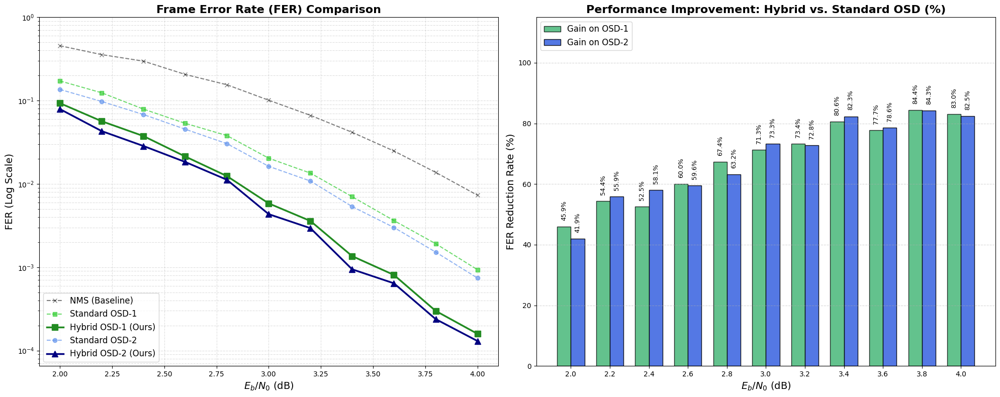

# OSD-CNN: CNN-Enhanced LDPC NMS/OSD Decoder

**[中文版本 / Chinese Version](README_CN.md)** | English Version

---

This repository contains a complete end-to-end experiment of **NMS→OSD→CNN hybrid decoding** in a single Jupyter Notebook (`osd_cnn.ipynb`): from CCSDS standard LDPC code loading, mixed SNR data generation, DIANet training, comparison simulation of NMS/OSD-1/OSD-2/CNN-OSD, and visualization. The current implementation uses a **unified NMS normalization factor `alpha=0.78`**, consistent across training and simulation phases to ensure data distribution alignment.

---

## ✨ Features
- 📦 **Standard LDPC Code Support**: Loads CCSDS (128, 64) code from Alist format file, automatically generates G matrix via Gaussian elimination.
- 🔁 **Unified NMS Normalization Strategy**: Both `decode_nms_trajectory` and hybrid OSD use the same `alpha=0.78`, facilitating experiment reproduction and avoiding data distribution drift.
- 📚 **Mixed-SNR Training Data**: Training set covers 2.0–4.0 dB, with multi-SNR samples sharing the same NMS configuration.
- 🧠 **DIANet Trajectory Learning**: Takes NMS LLR trajectory `(n, T)` as input, outputs soft information gain for each bit.
- 🎯 **OSD Algorithm Implementation**: Supports OSD-1 and OSD-2, includes adaptive Gaussian elimination and Top-K acceleration optimization.
- 🛟 **CNN-OSD Fusion**: `hybrid_soft = y + 0.78 * cnn_logits`, directly uses enhanced soft information in OSD-1/2.
- 📈 **End-to-End Visualization**: Notebook includes FER curves, gain bar charts, and performance comparison tables, showing results for both OSD-1 and OSD-2.

---

## 📁 Repository Layout
```
osd-cnn/
├── osd_cnn.ipynb              # Main experiment Notebook (code + documentation)
├── dia_model_best.pth         # Trained DIANet model parameters
├── CCSDS_ldpc_n128_k64.alist  # CCSDS standard LDPC code in Alist format
├── README.md                   # This document (English)
└── README_CN.md                # Chinese version
```

---

## ⚡ Quick Start

### Option 1: Google Colab
1. Open [Colab](https://colab.research.google.com/github/bayonetta/osd-cnn/blob/main/osd_cnn.ipynb) directly.
2. Runtime → Change runtime type → Select GPU.
3. Run cells sequentially. The notebook will automatically install dependencies, generate data, train DIANet, and run simulations.

### Option 2: Local Environment
1. Install dependencies (if not auto-installed by the notebook, refer to requirements and install via pip).
2. Start Jupyter: `jupyter notebook`.
3. Open `osd_cnn.ipynb` and execute all cells in order.

---

## 🧩 Core Components
| Module | Content | Highlights |
|--------|---------|------------|
| **LDPC Code Loading** | Loads CCSDS (128, 64) code from Alist file, generates G matrix via Gaussian elimination | Supports standard format, auto-verifies H@G.T=0 |
| **NMS Decoding + Trajectory Recording** | `decode_nms_trajectory`, fixed `alpha=0.78` | Records iterative LLR trajectory, outputs failure samples |
| **Mixed-SNR Data Generation** | Only keeps NMS failure frames, `TOTAL_SAMPLES = 60000` | SNR randomly sampled but shares same alpha |
| **DIANet Training** | `BCEWithLogitsLoss` + `Adam (1e-3)` + EarlyStopping | Takes trajectory as input, predicts bit error tendency |
| **OSD Algorithm** | OSD-1/OSD-2, adaptive Gaussian elimination, Top-K acceleration | Supports standard OSD and CNN-enhanced hybrid OSD |
| **CNN-OSD Fusion** | `hybrid_soft = y + 0.78 * cnn_logits` | Compares FER/BER/time with pure OSD |
| **Visualization** | FER curves, gain bar charts, performance tables | Shows overall performance of NMS / OSD-1/2 / CNN-OSD |

---

## 🧮 Key Hyper-Parameters
- `MAX_ITER_NMS = 12`: NMS iteration count.
- `alpha = 0.78`: NMS normalization factor, uniformly used as fixed value in both training and simulation phases to ensure consistent data distribution.
- `MAX_FRAMES = 1,000,000`, `MIN_CNN_ERRORS = 50`: Simulation termination conditions.
- `BATCH_SIZE = 512`: DIANet training batch size.
- `TOTAL_SAMPLES = 60,000`: Mixed-SNR failure frames for training.
- `R = 0.5`: Code rate (CCSDS (128, 64) code).

---

## 📊 Latest Simulation Snapshot



> Simulation uses CCSDS (128, 64) code, unified alpha=0.78, SNR range 2.0-4.0 dB (step 0.2 dB).

---

## 📚 References
1. Gallager, R. G. *Low-density parity-check codes*, 1962.
2. Fossorier, M. P. C., & Lin, S. *Soft-decision decoding of linear block codes*, 1995.
3. Chen, J., & Fossorier, M. P. C. *Near optimum universal belief propagation based decoding of LDPC codes*, 2002.
4. Jia, M. et al. *Ordered Statistics Decoding for Short Block Codes*, 2019.

